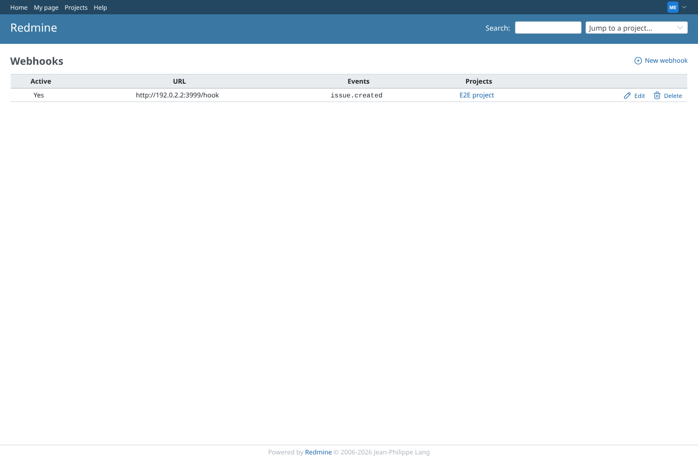
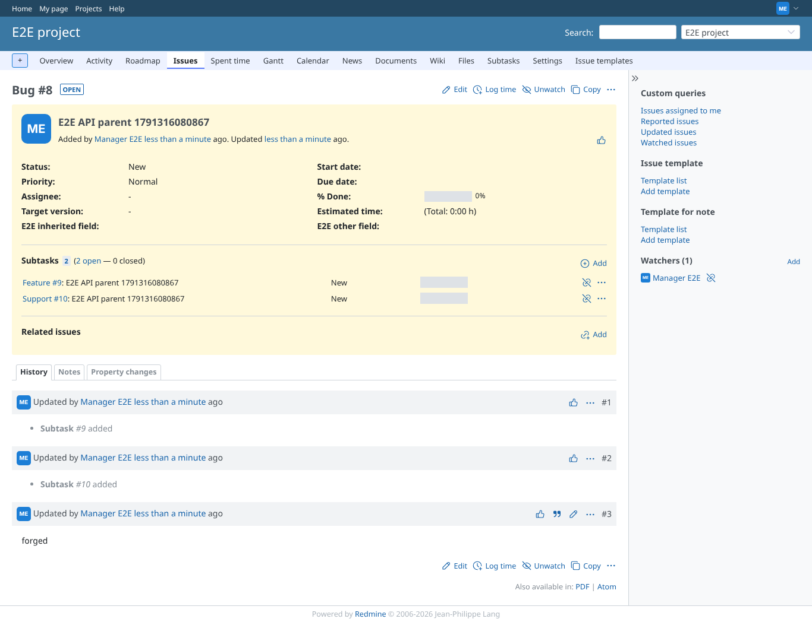

# api-webhook

Run 2026-10-06T19:48:10.075Z against http://127.0.0.1:3000.

| screenshot | user | URL | shows |
|---|---|---|---|
|  | manager | `/webhooks` | Manager registers a webhook for "issue created" in e2e-project, pointing to a local receiver |
|  | manager | `/issues/8` | Issue created through the REST API: Feature (asked) and Support (forced) subtasks; the forged update and the bare update added nothing |
