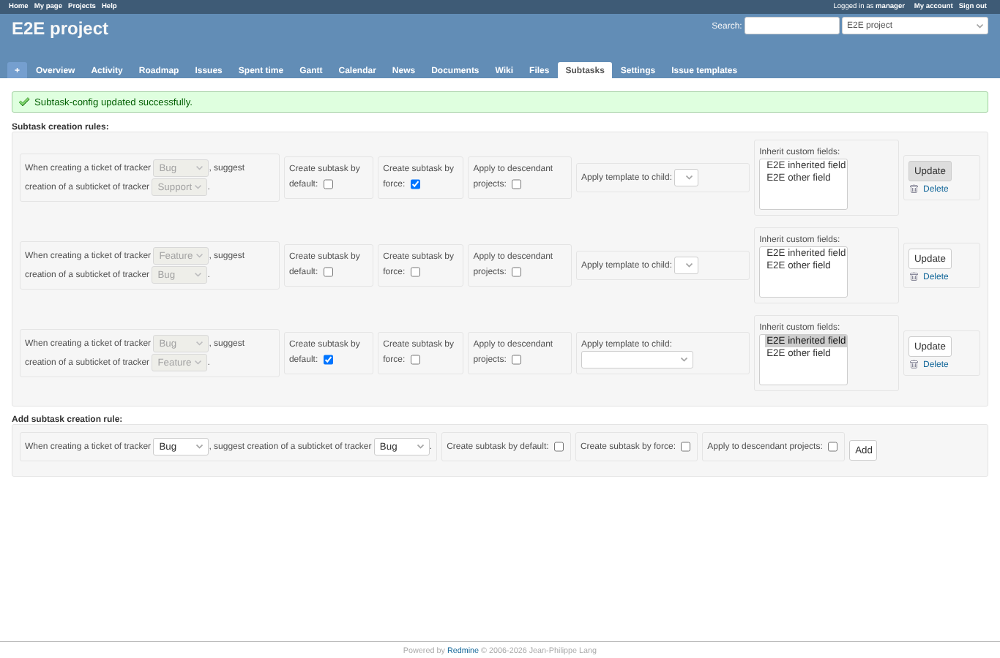
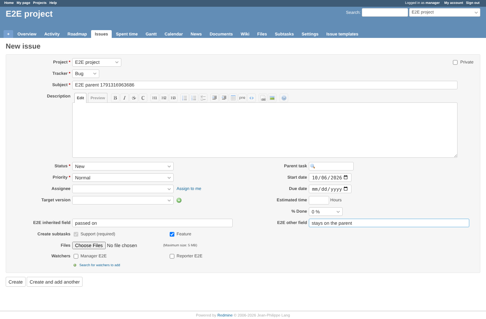
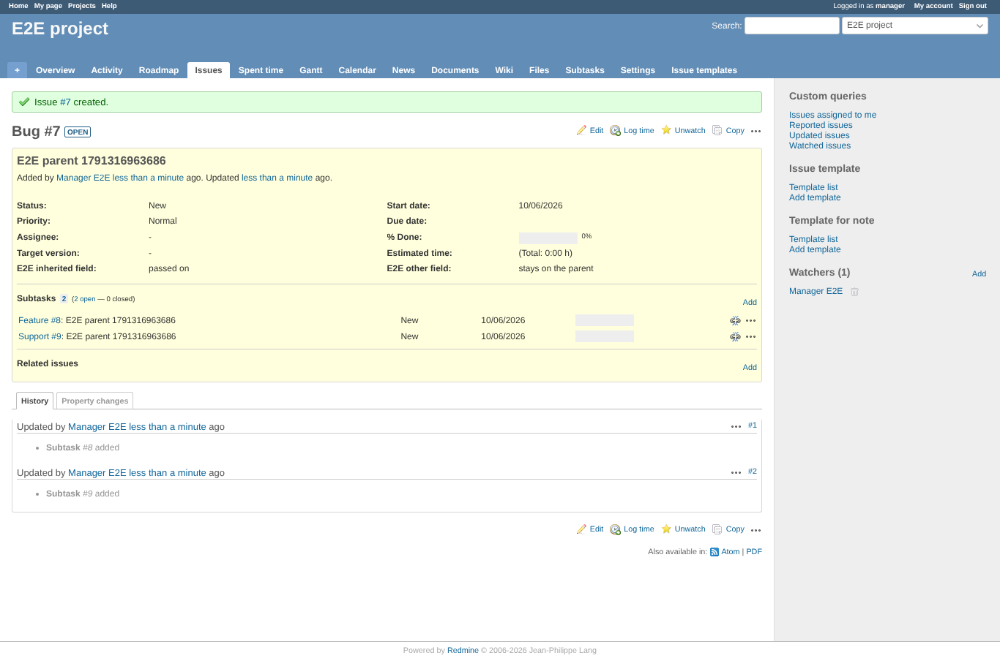
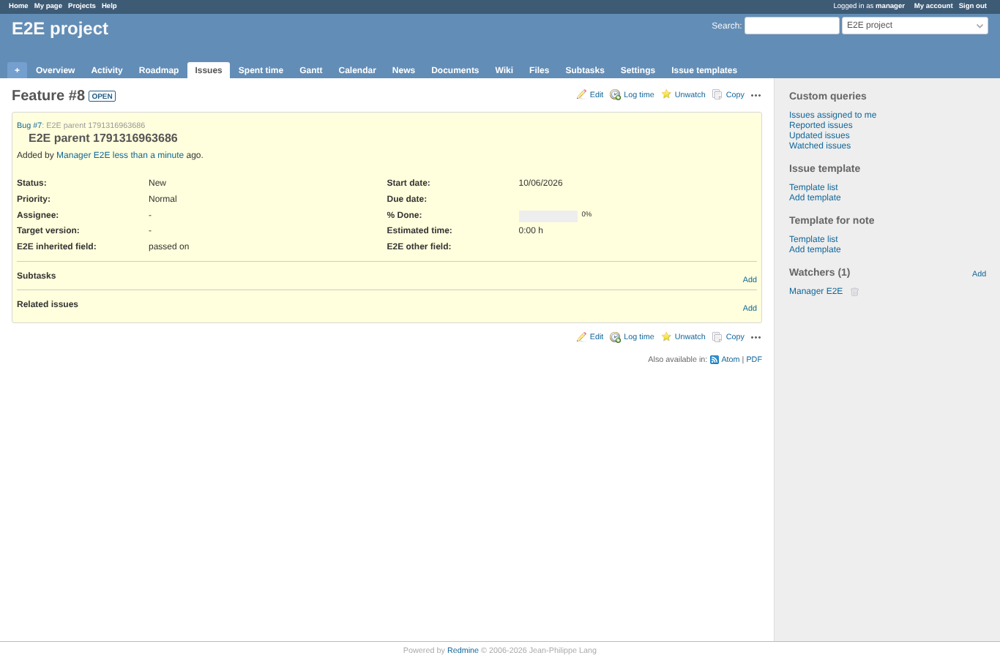
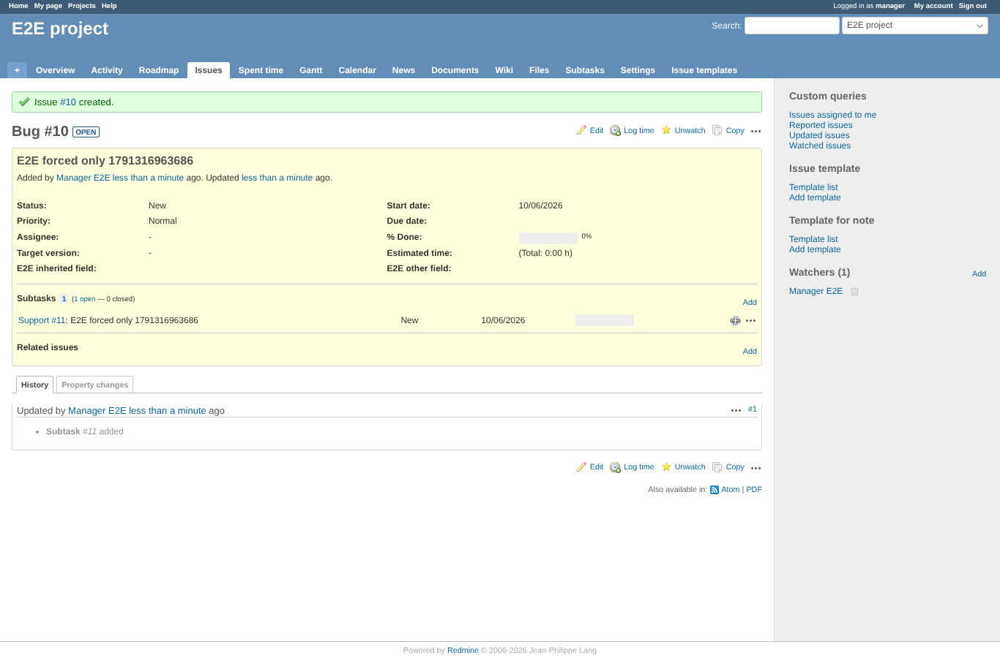
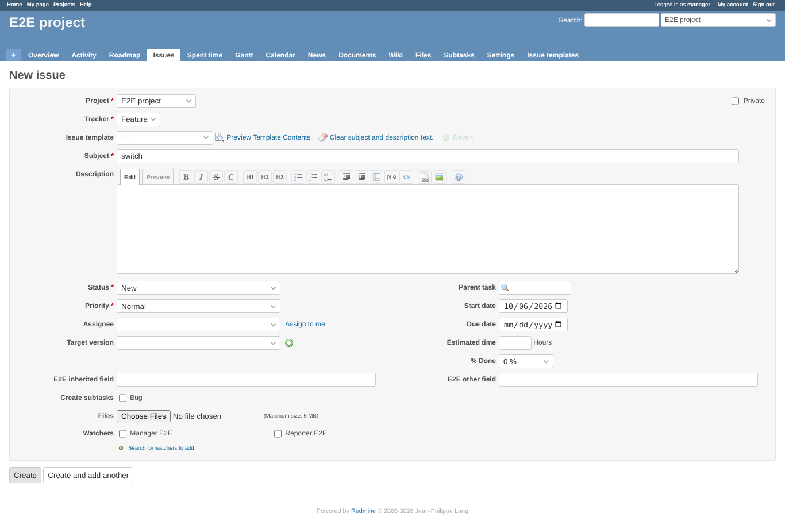
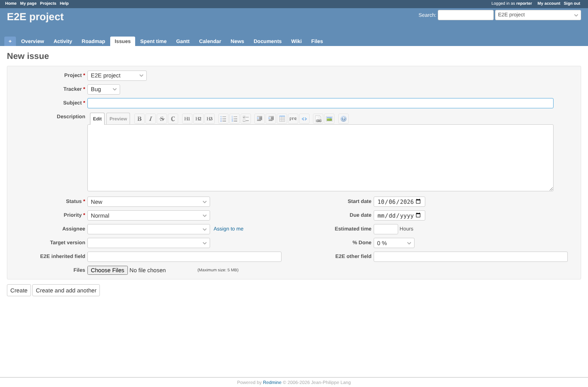
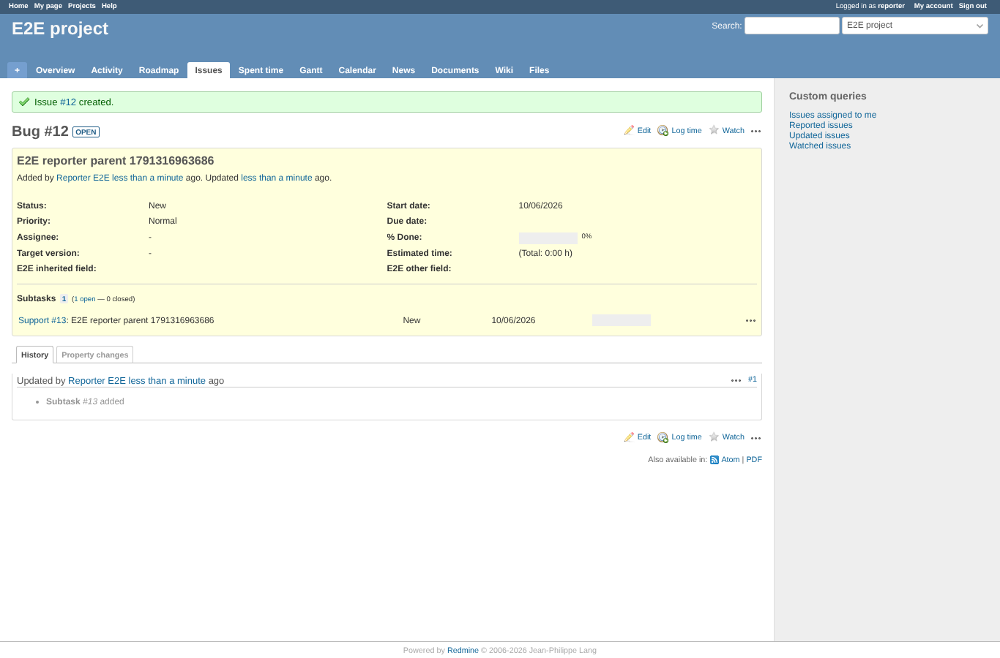
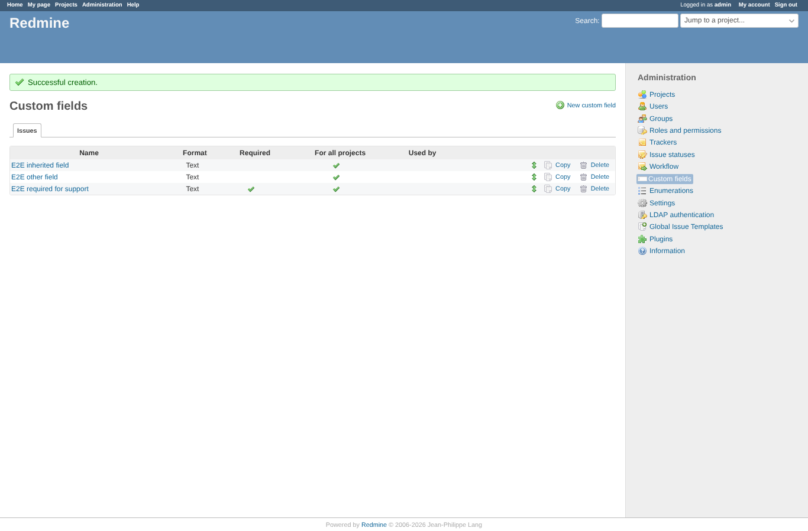
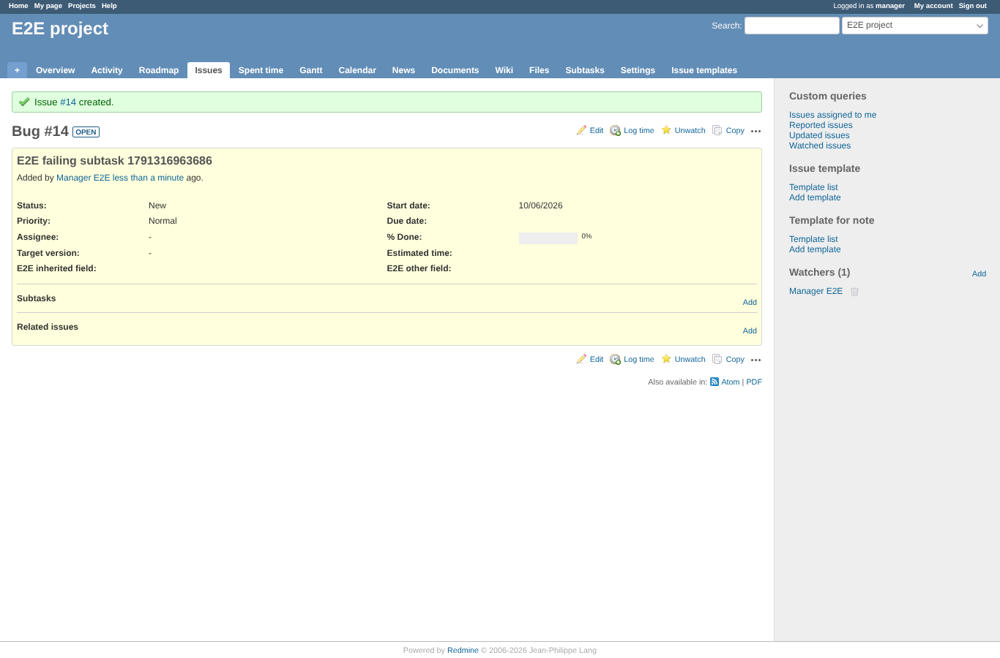

# create-subtasks

Run 2026-10-06T20:03:35.258Z against http://127.0.0.1:3001.

| screenshot | user | URL | shows |
|---|---|---|---|
|  | manager | `/projects/e2e-project/subtask_settings/show` | Rules: Bug -> Feature by default with "E2E inherited field", Bug -> Support by force, Feature -> Bug |
|  | manager | `/projects/e2e-project/issues/new` | New Bug: Feature ticked by default, Support required (ticked and locked) |
|  | manager | `/issues/7` | Issue created with two subtasks (Feature, Support) carrying the parent subject |
|  | manager | `/issues/8` | The Feature subtask: parent link, inherited field filled, the other field empty, empty description |
|  | manager | `/issues/10` | Feature unticked: only the forced Support subtask is created |
|  | manager | `/projects/e2e-project/issues/new` | Tracker switched to Feature: the form now offers the Feature -> Bug rule only |
|  | reporter | `/projects/e2e-project/issues/new` | Reporter (no "Create subtasks" permission): no subtask choices on the form |
|  | reporter | `/issues/12` | Reporter's Bug still gets the forced Support subtask (forced rules apply to everyone) |
|  | admin | `/custom_fields?tab=IssueCustomField` | Admin adds a required field "E2E required for support" to the Support tracker |
|  | manager | `/issues/14` | Forced Support subtask fails on a required field: the parent is created and the error names the tracker and the field |

## Problems

- error flash: ""
