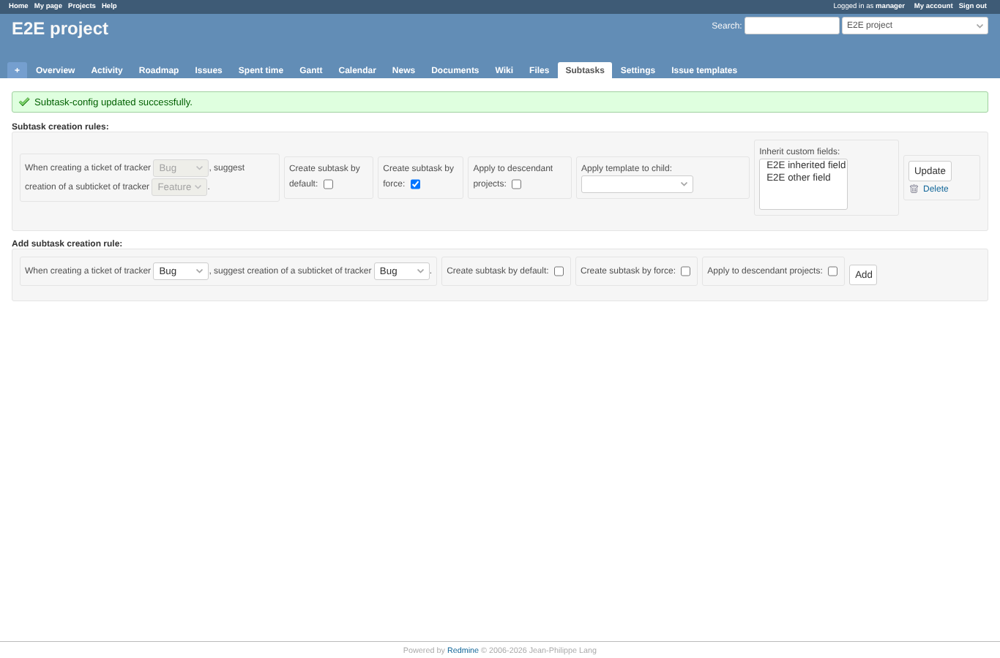
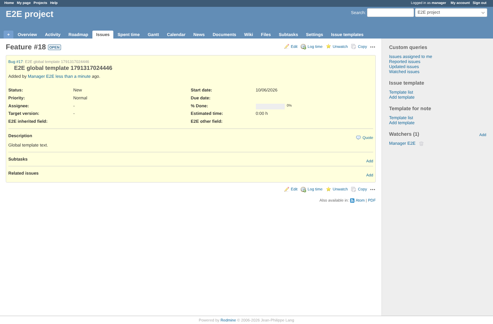
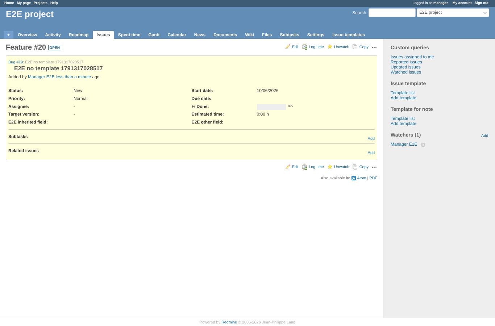

# templates

Run 2026-10-06T20:04:22.621Z against http://127.0.0.1:3001.

| screenshot | user | URL | shows |
|---|---|---|---|
|  | manager | `/projects/e2e-project/subtask_settings/show` | Project template chosen (id 1, same id as the global template): it stays selected after saving |
|  | manager | `/issues/16` | The Feature subtask got the project template as description, not the parent's or the global one |
|  | manager | `/projects/e2e-project/subtask_settings/show` | Global template chosen: it stays selected after saving |
|  | manager | `/issues/18` | The Feature subtask got the global template as description |
|  | manager | `/issues/20` | No template: the subtask has an empty description (the parent's is not copied) |

## Problems

- template shown after saving "E2E project template": " "
- subtask description with the project template: "Quote

Description

Global template text."
- template shown after saving "E2E global template": " "
