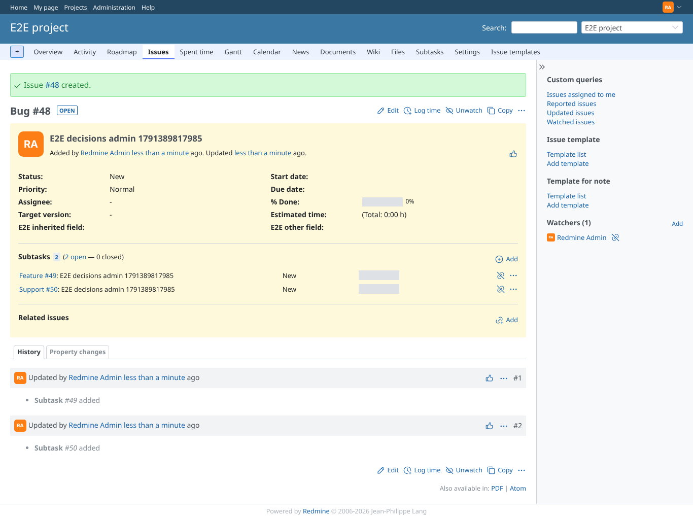
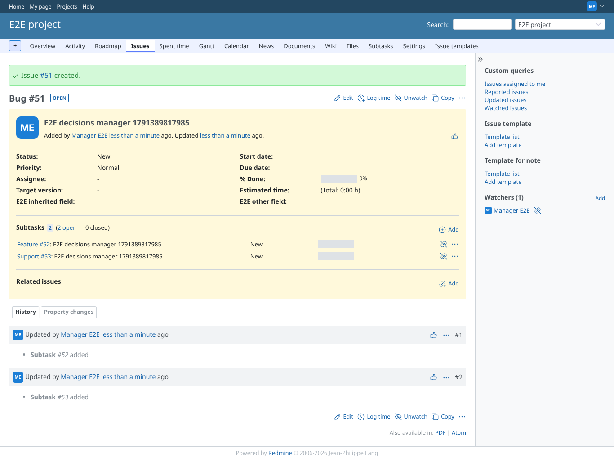
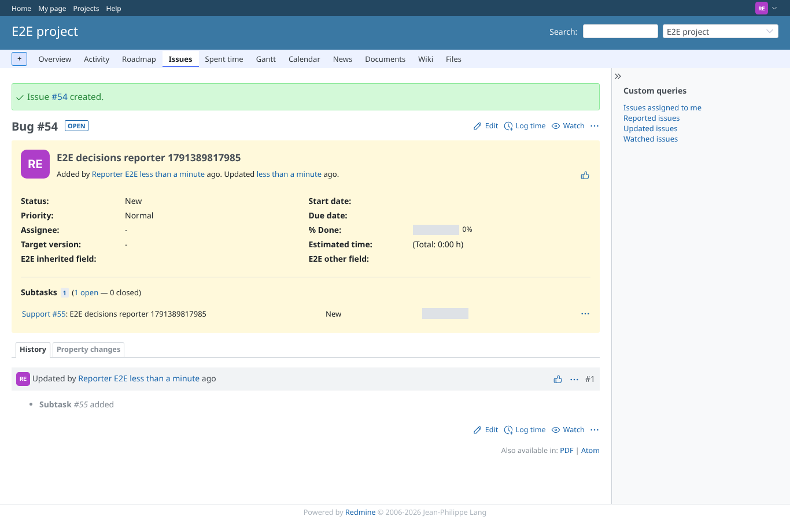
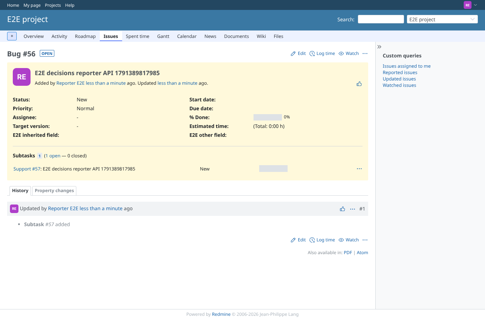
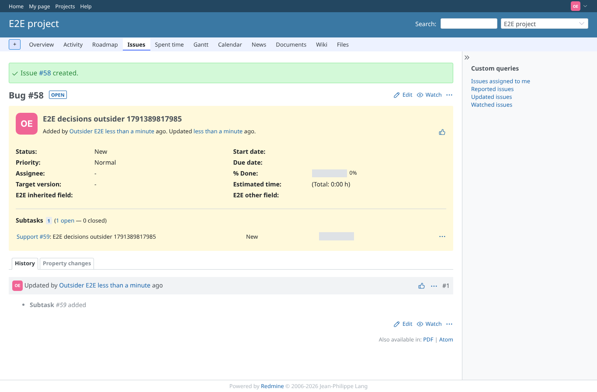
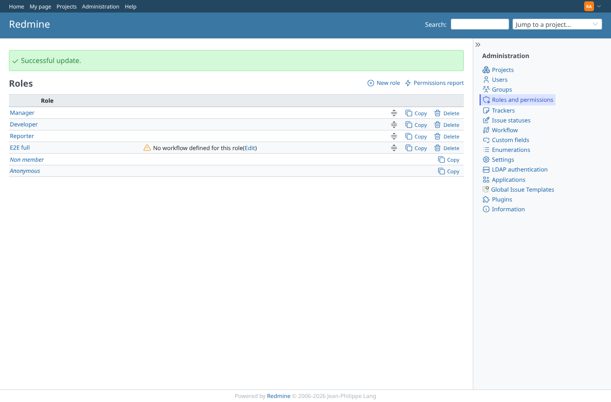
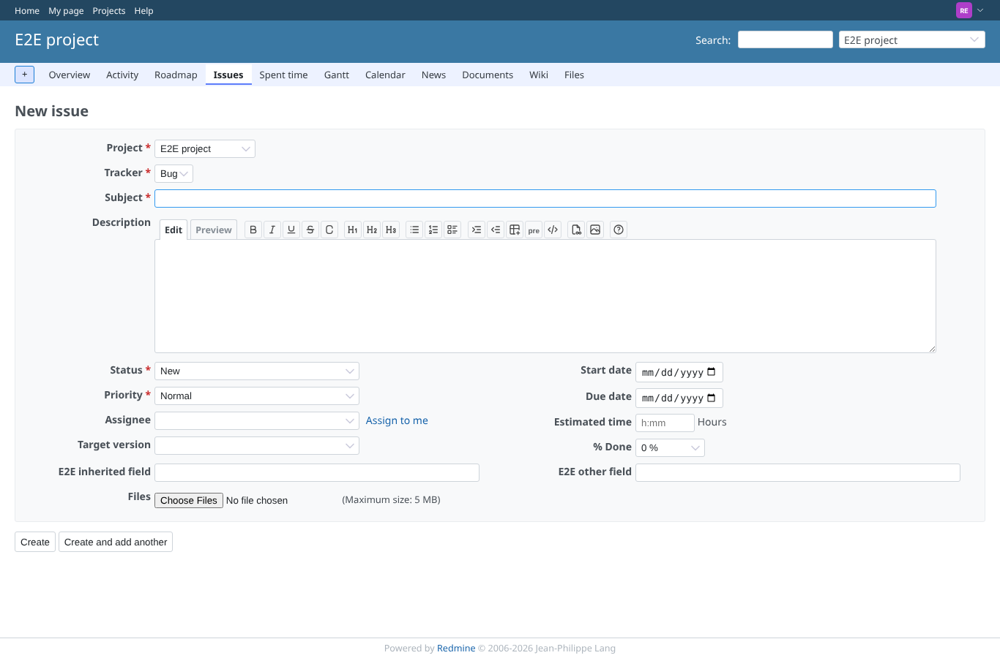
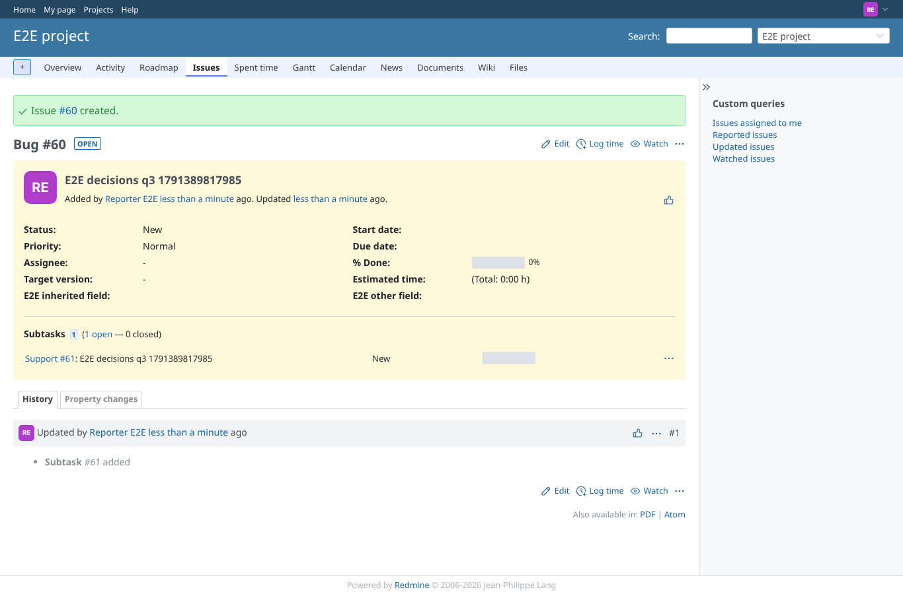

# decisions

Run 2026-10-07T16:17:28.900Z against http://127.0.0.1:3000.

| screenshot | user | URL | shows |
|---|---|---|---|
|  | admin | `/issues/48` | admin: Feature (ticked) and Support (forced) subtasks created |
|  | manager | `/issues/51` | manager: Feature (ticked) and Support (forced) subtasks created |
|  | reporter | `/issues/54` | q1: reporter without "Create subtasks" sees no choices but gets the forced Support subtask |
|  | reporter | `/issues/56` | q2: reporter asks for the Feature subtask through the API: refused silently, only the forced Support one |
|  | outsider | `/issues/58` | q1: outsider (non-member) creating a Bug in the public project also gets the forced Support subtask |
|  | outsider | `/projects/e2e-private/issues/new` | Outsider: new issue in the private project is refused (403) |
|  | admin | `/roles` | Admin saved the Reporter role with "Add issues" limited to the Bug tracker (Successful update) |
|  | reporter | `/projects/e2e-project/issues/new` | Refusal: the reporter can only choose Bug, not Support, for a new issue |
|  | reporter | `/issues/60` | q3: the rule decides: the reporter's Bug still gets its forced Support subtask |
