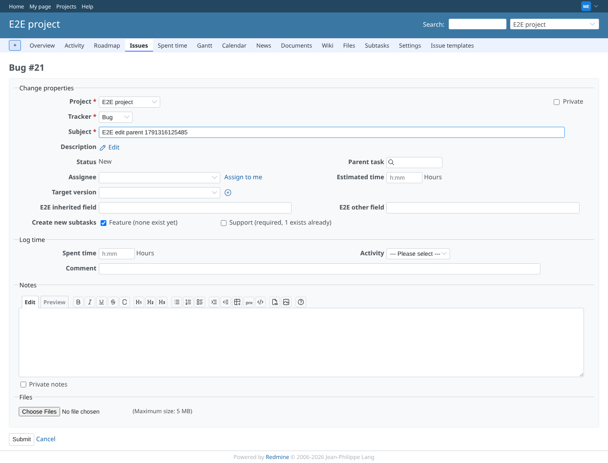
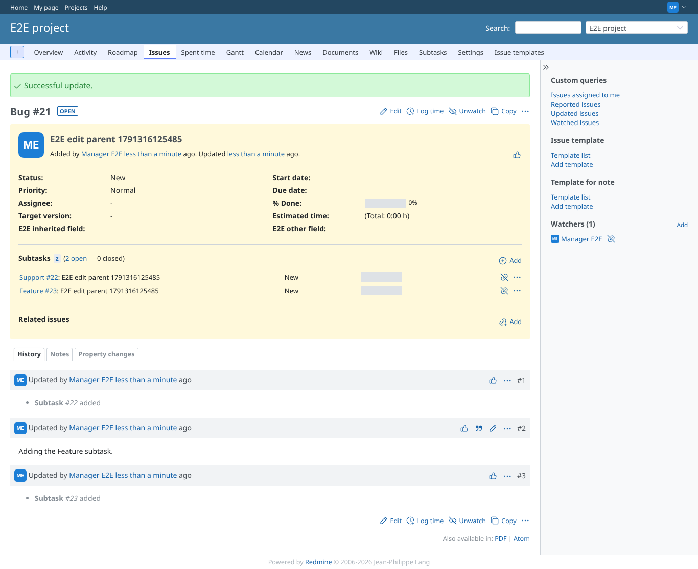
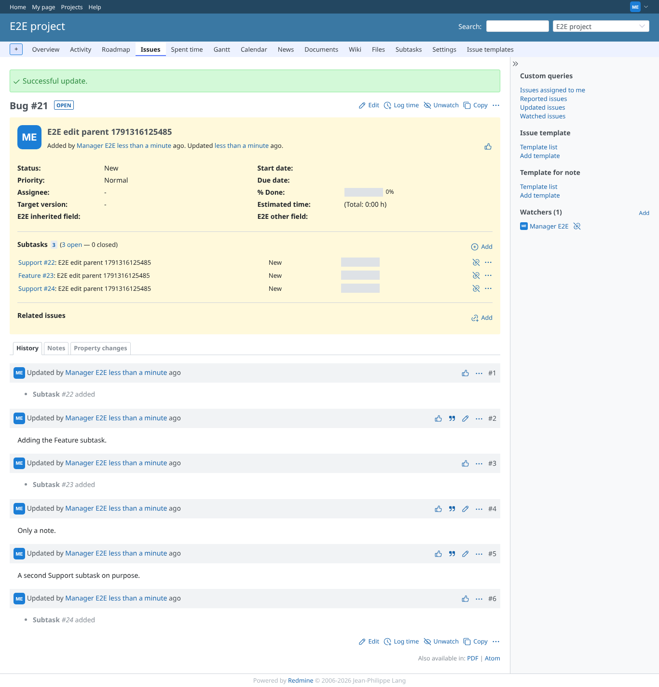
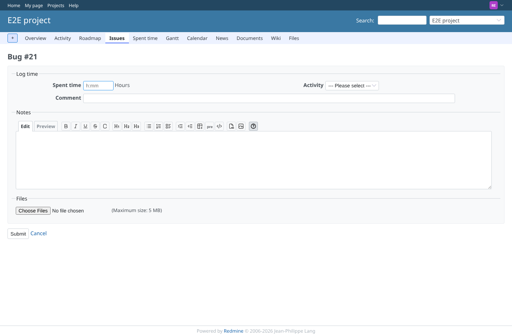

# edit-subtasks

Run 2026-10-06T19:48:58.028Z against http://127.0.0.1:3000.

| screenshot | user | URL | shows |
|---|---|---|---|
|  | manager | `/issues/21/edit` | Edit: Support "(required, 1 exists already)" unticked, Feature "(none exist yet)" ticked by default |
|  | manager | `/issues/21` | Saved: the Feature subtask is created next to the existing Support one, the note is kept |
|  | manager | `/issues/21/edit` | Edit again: Feature now "(1 exists already)" and no longer ticked |
|  | manager | `/issues/21` | Ticking Support again creates a second Support subtask, as asked |
|  | reporter | `/issues/21/edit` | Reporter (core role without "Edit issues" and without the plugin permission): notes-only form, no subtask choices |
