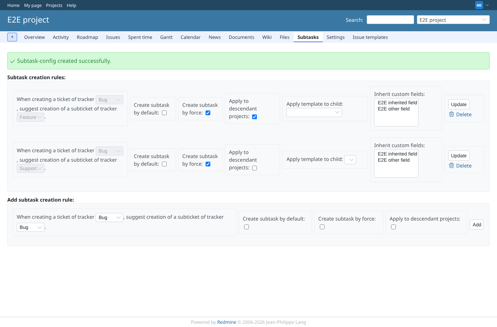
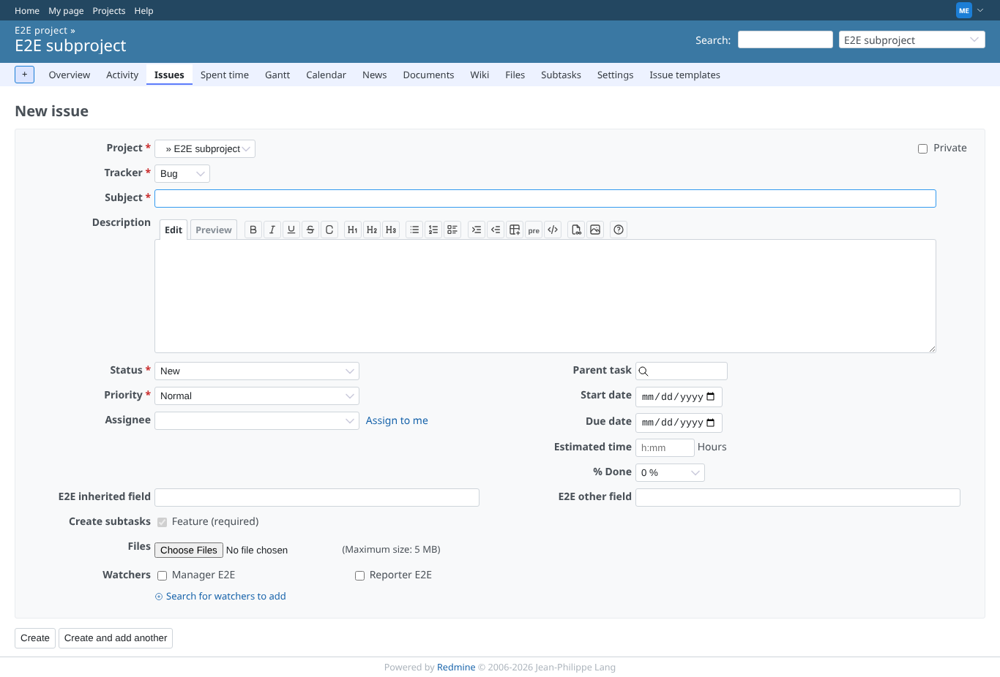
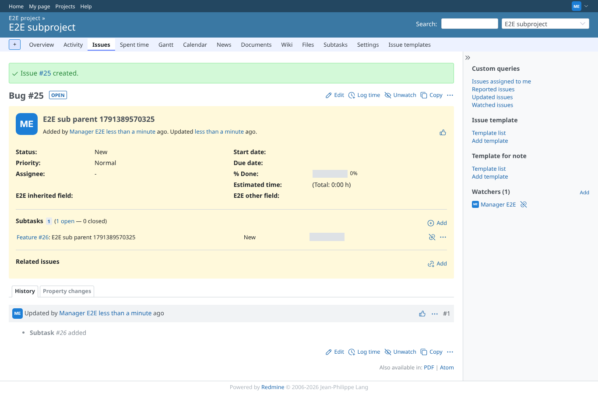
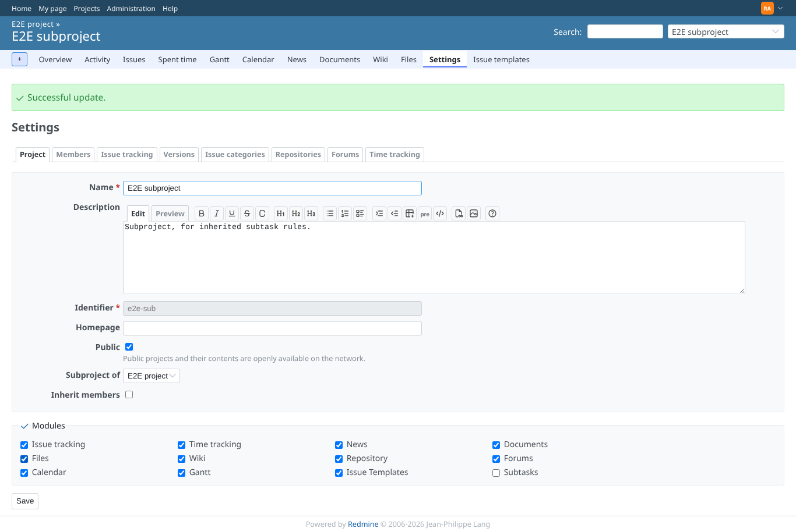
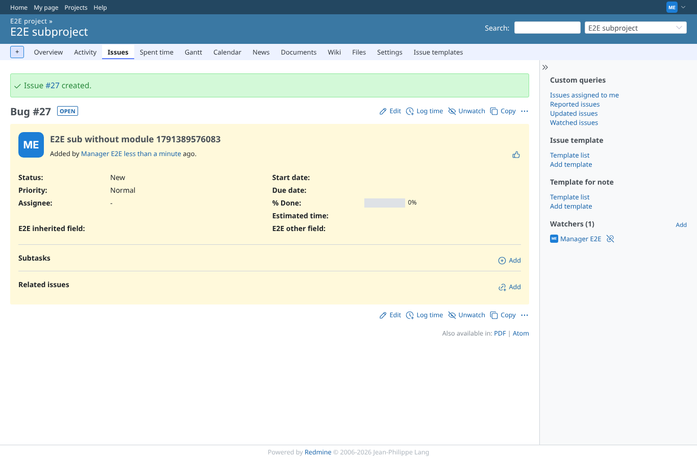

# inheritance

Run 2026-10-07T16:13:03.614Z against http://127.0.0.1:3000.

| screenshot | user | URL | shows |
|---|---|---|---|
|  | manager | `/projects/e2e-project/subtask_settings/show` | e2e-project: Bug -> Feature forced and applied to descendant projects, Bug -> Support forced for this project only |
|  | manager | `/projects/e2e-sub/issues/new` | New Bug in e2e-sub: only the inherited Feature rule is offered (required) |
|  | manager | `/issues/25` | Created in e2e-sub: one Feature subtask from the inherited rule, none from the non-inherited one |
|  | admin | `/projects/e2e-sub/settings` | Admin turns the "Subtasks" module off in e2e-sub |
|  | manager | `/issues/27` | Module off in e2e-sub: no choices, no "Subtasks" menu, and the forced inherited rule creates nothing |
