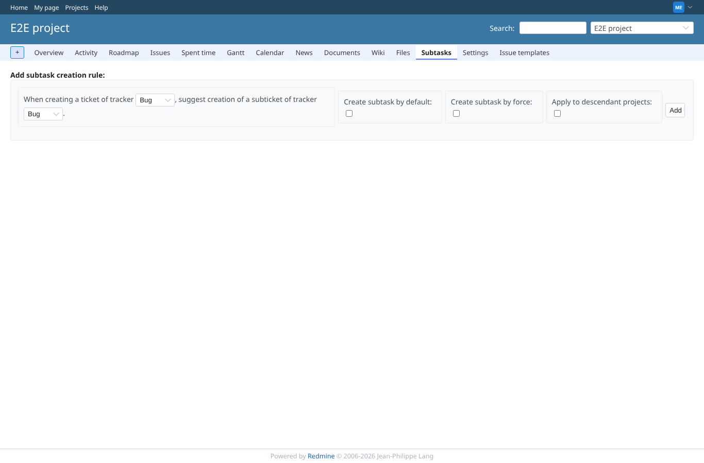
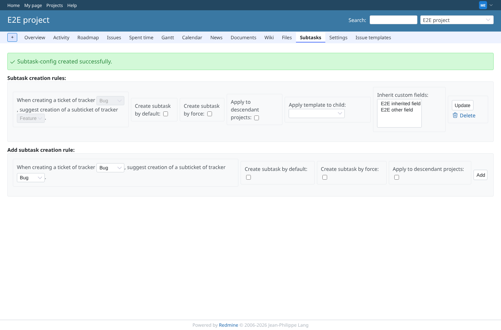
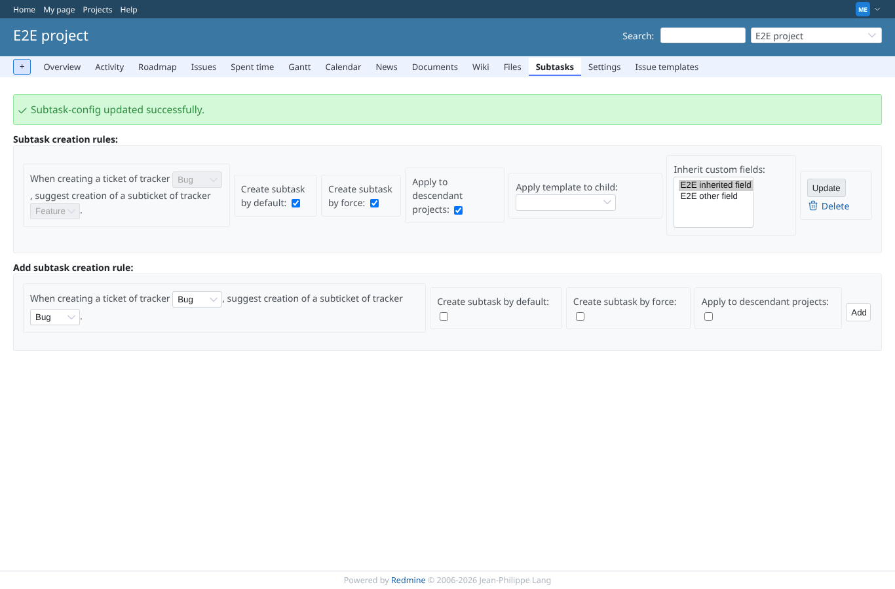
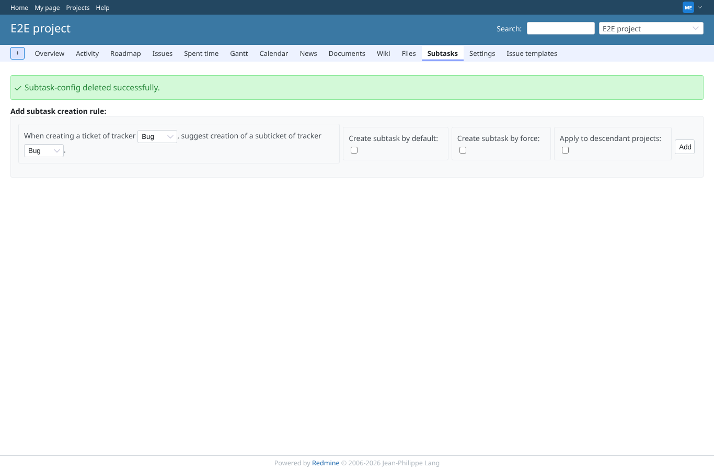
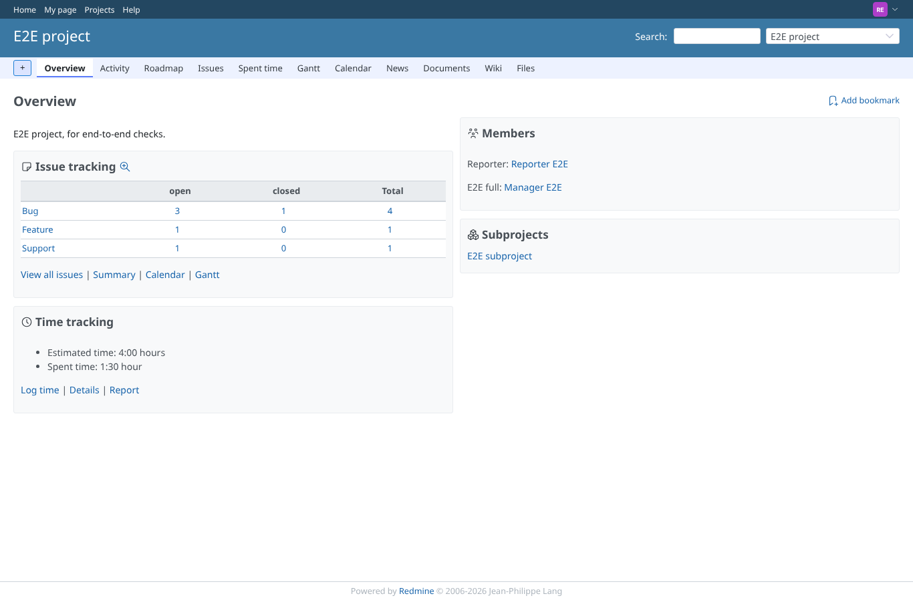

# settings

Run 2026-10-06T20:18:43.308Z against http://127.0.0.1:3000.

| screenshot | user | URL | shows |
|---|---|---|---|
|  | manager | `/projects/e2e-project/subtask_settings/show` | Manager opens "Subtasks" from the project menu: no rules yet, only the form to add one |
|  | manager | `/projects/e2e-project/subtask_settings/show` | Rule Bug -> Feature added: notice, rule listed with its options and the SVG delete icon |
|  | manager | `/projects/e2e-project/subtask_settings/show` | Rule updated: by default, by force, descendant projects and an inherited custom field are kept |
|  | manager | `/projects/e2e-project/subtask_settings/show` | Rule deleted after the confirmation: notice, empty list |
|  | manager | `/projects/no-such-project/subtask_settings/show` | An unknown project answers 404 inside the Redmine layout |
|  | reporter | `/projects/e2e-project` | Reporter (no plugin permission): no "Subtasks" item in the project menu |
|  | reporter | `/projects/e2e-project/subtask_settings/show` | Reporter opening the settings page directly: 403 |
|  | outsider | `/projects/e2e-private/subtask_settings/show` | Outsider on the private project settings page: 403, nothing shown |
|  | anonymous | `/login?back_url=http%3A%2F%2F127.0.0.1%3A3000%2Fprojects%2Fe2e-project%2Fsubtask_settings%2Fshow` | Anonymous: redirected to the login page |
