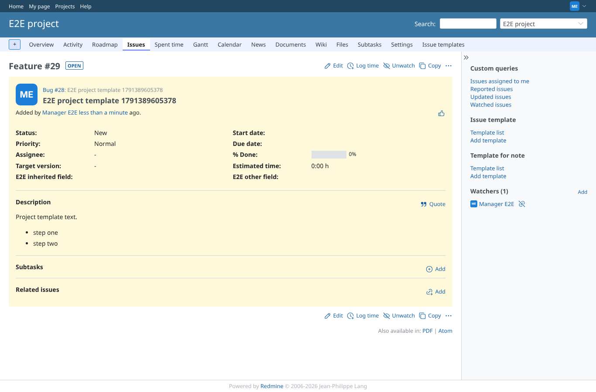
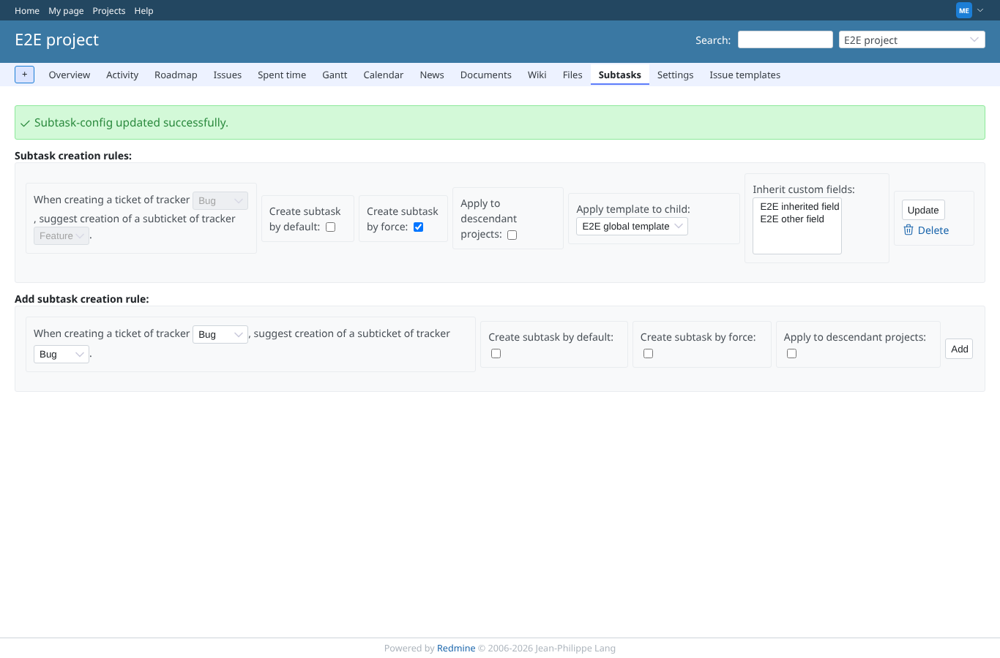
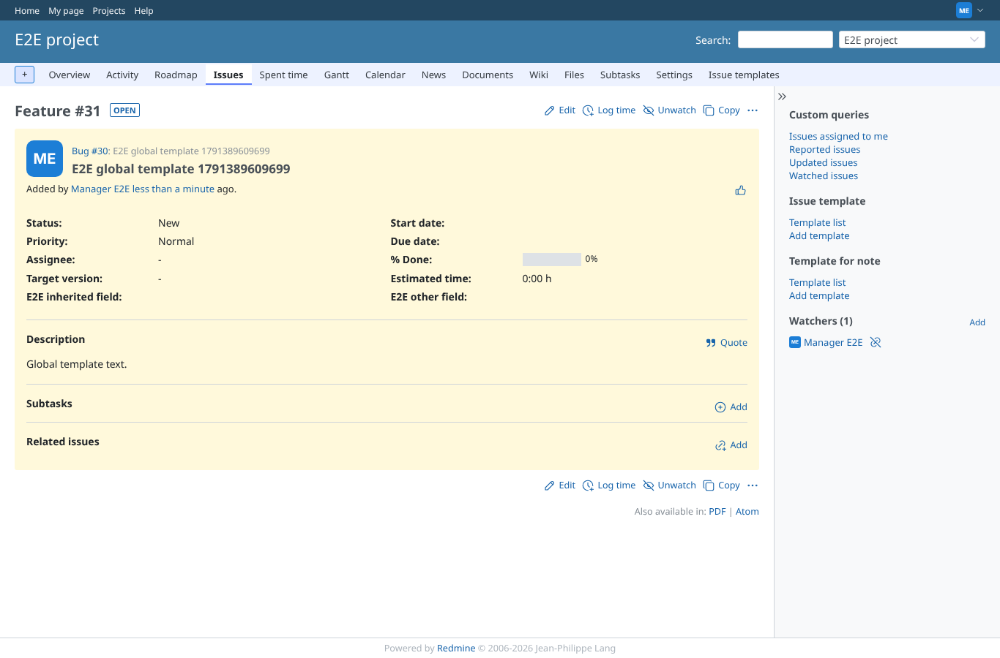
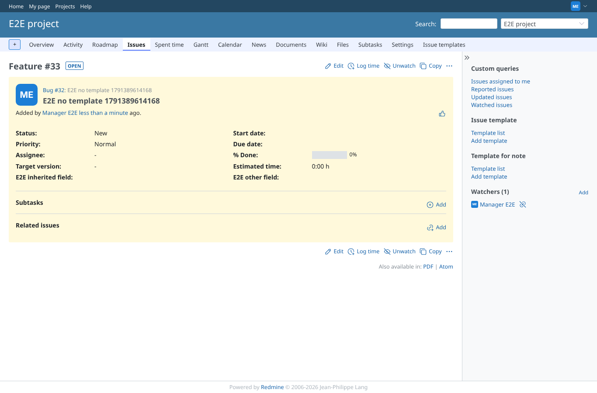

# templates

Run 2026-10-07T16:14:08.294Z against http://127.0.0.1:3000.

| screenshot | user | URL | shows |
|---|---|---|---|
|  | manager | `/projects/e2e-project/subtask_settings/show` | Project template chosen (id 1, same id as the global template): it stays selected after saving |
|  | manager | `/issues/29` | The Feature subtask got the project template as description, not the parent's or the global one |
|  | manager | `/projects/e2e-project/subtask_settings/show` | Global template chosen: it stays selected after saving |
|  | manager | `/issues/31` | The Feature subtask got the global template as description |
|  | manager | `/issues/33` | No template: the subtask has an empty description (the parent's is not copied) |
